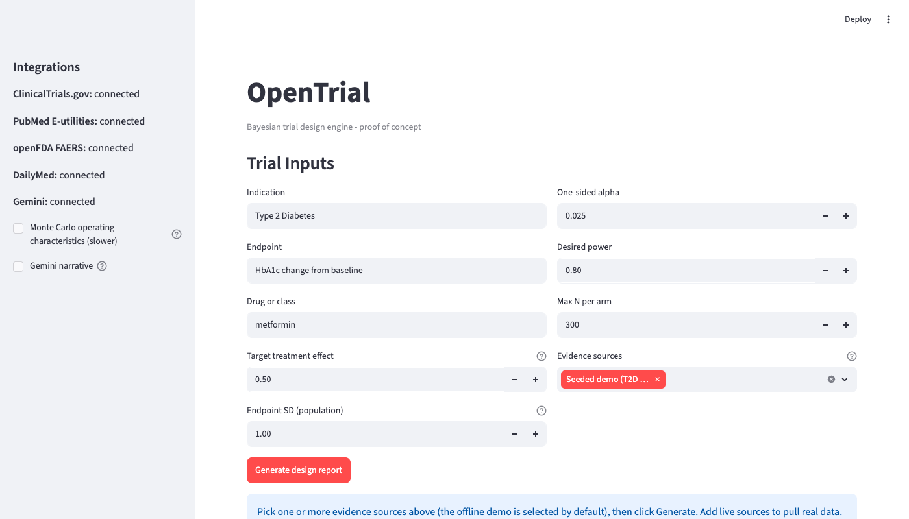

# OpenTrial

[](https://github.com/ds4cabs)
[](https://ds4cabs.github.io/OpenTrial/)


**Intern:** Reuben N Addison
**Project Type:** Computation Engine

## What it is
OpenTrial is a **proof-of-concept** Bayesian trial-design report engine. You describe a
two-arm trial; it returns a reproducible report whose **prior is traceable to cited evidence**
and whose **operating characteristics** (power, and a simulated Type I error) are the part a
statistician can actually check. It is scoped as a clean PoC, one design done well, not a
production tool.



*The proof of concept: a continuous two-arm design, four core evidence sources, and the
operating-characteristics path: input to cited prior to power/Type-I to downloadable report.*

## The proof-of-concept, in one path
The whole project is built around a single, end-to-end path, a two-arm trial on a continuous
endpoint, demonstrated with seeded **Type 2 Diabetes / HbA1c** evidence:

1. **Trial inputs**: indication, endpoint, target effect, endpoint SD, alpha, desired power, max N.
2. **Evidence-derived prior with provenance**: every contributing record is listed with its
   source and link; only records with a real standard error move the prior.
3. **Operating characteristics**: a sample-size grid with power, beta, an alpha/Type-I
   reference, and prior-predictive assurance; plus an optional Monte-Carlo pass that reports an
   **empirical Type I error** as a calibration check.
4. **Downloadable report**: Markdown (for people) and JSON (for a reproducible record).

> **Why this is the story.** For a Bayesian/adaptive design, the most scrutinized output is
> Type I error / power under the design, justified by simulation, with the priors traceable to
> their sources. OpenTrial's report leads with exactly that; see *Operating characteristics &
> provenance* below. This maps to the FDA expectations for adaptive designs (pre-specification,
> Type I error control, simulation-based justification).

## Quickstart
```bash
python3 -m venv .venv
source .venv/bin/activate              # Windows: .venv\Scripts\activate
python3 -m pip install -e ".[dev]"     # install OpenTrial + test tools
python3 -m pytest                       # offline suite, no network/keys needed
streamlit run app.py                    # opens in your browser
```
With no configuration it runs **fully offline** on the seeded T2D / HbA1c demo; the complete
PoC path works on day one. To pull live evidence, copy `.env.example` to `.env`, set
`OPENTRIAL_USE_LIVE_APIS=true`, and add any optional keys (see **Configuration**).

## How to use it
1. Fill in the trial-design form (indication, endpoint, target effect, endpoint SD, alpha,
   desired power, max N per arm).
2. Leave **Evidence sources** on the seeded demo (default) or tick live sources.
3. Click **Generate design report**.
4. Read the prior summary, the operating-characteristic curves, and the provenance table;
   download the report as Markdown or JSON.

## Operating characteristics & provenance (the part to scrutinize)
This is the heart of the PoC and the thing reviewers should look at first:

- **Power / beta / assurance.** The report's operating-characteristics table walks sample size
  upward and shows, at each N: power at the target effect, beta (Type II error), an alpha /
  Type-I-error reference, and prior-predictive **assurance** (success averaged over the prior).
- **Simulated Type I error.** Tick *Monte Carlo operating characteristics* to estimate power,
  assurance, and the **empirical Type I error** by simulation. For this design the empirical
  Type I should land on the nominal alpha, a visible calibration check, not a number you are
  asked to trust. (`src/opentrial/compute/mc.py`, standard-library only.)
- **Prior provenance.** Every evidence record that informs the prior is listed with its source,
  year, linked title, effect, and standard error. Records without a usable effect (registry
  rows, safety counts, labels) are shown for provenance but **excluded from the prior**, the
  central honesty rule.

## Core data sources (PoC scope)
The PoC tells a complete story with a small set of sources, working well:

- **ClinicalTrials.gov** (v2 studies API): US trial precedent.
- **PubMed** (NCBI E-utilities): published effect estimates, with a cautious effect + 95% CI extractor.
- **openFDA FAERS**: post-market safety-signal context.
- **DailyMed**: structured label provenance (dosing / adverse events).

Live sources are off by default; the seeded demo needs none of them.

## Configuration (`.env`)
| Variable | Enables | Required? |
| --- | --- | --- |
| `OPENTRIAL_USE_LIVE_APIS` | the live public sources (CT.gov, PubMed, openFDA, DailyMed, …) | Off by default |
| `NCBI_EMAIL`, `NCBI_API_KEY` | PubMed etiquette / higher rate limits | Optional |
| `GEMINI_API_KEY` | optional AI narrative synthesis | Optional |
| `OPENTRIAL_DEBUG` | verbose logging + exception detail in warnings | Off by default |
| `OPENTRIAL_HTTP_RETRIES` | retries for transient API errors (429/5xx/timeout) | Default 2 |

## Tech Stack
Python 3.11+: **standard library for the default math** (`statistics`, `math`, `urllib`,
`xml`, `re`), **Pydantic** for validated domain models, **Streamlit** for the UI. The
statistics are deterministic by default; Gemini, when used, is called over its REST API for
narrative only and never changes the numbers.

---

## Future work (beyond the proof of concept)
Deliberately out of scope for the PoC; the foundation for a fuller version later:
- **More evidence sources**: WHO ICTRP (request-based access), Open Targets (disease-target
  biology), PharmGKB (pharmacogenomics), and broader literature search.
- **Binary / count endpoints**: a two-proportion (risk-difference) and beta-binomial design.
- **A fuller Bayesian engine**: e.g. a PyMC random-effects prior and group-sequential simulation.
- **Audit mode**: benchmark an existing NCT/PMID trial against the recommendation.
- **Prior sensitivity analysis**: weak / evidence / skeptical / optimistic priors side by side.
- **PDF export**, richer plots, and, before any real-world use, a statistician's review and
  formal validation.

## Notes
This is a learning-oriented proof of concept, not a validated clinical tool. The report's own
Notes section states the model's assumptions; the math is a transparent approximation by
design, with simulation available to check it.
