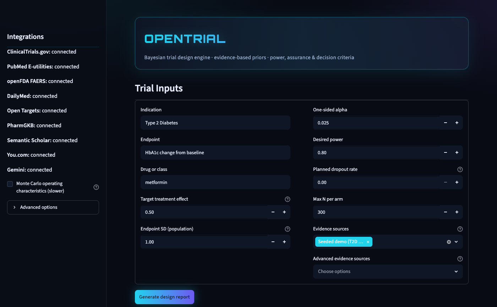

# OpenTrial

[](https://github.com/ds4cabs)
[](https://ds4cabs.github.io/OpenTrial/)


**Intern:** Reuben N Addison
**Project Type:** Computation Engine

## What it is
OpenTrial is a **proof-of-concept** Bayesian trial-design report engine. You describe a
two-arm trial; it returns a reproducible report whose **prior is traceable to cited evidence**
and whose **operating characteristics** (power, and a simulated Type I error) are the part a
statistician can actually check. It is scoped as a clean PoC, one design done well, not a
production tool.



*The proof of concept: a continuous two-arm design, four core evidence sources, and the
operating-characteristics path: input to cited prior to power/Type-I to downloadable report.*

## The proof-of-concept, in one path
The whole project is built around a single, end-to-end path, a two-arm trial on a continuous
endpoint, demonstrated with seeded **Type 2 Diabetes / HbA1c** evidence:

1. **Trial inputs**: indication, endpoint, target effect, endpoint SD, alpha, desired power, max N.
2. **Evidence-derived prior with provenance**: every contributing record is listed with its
   source and link; only records with a real standard error move the prior.
3. **Operating characteristics**: a sample-size grid with power, beta, an alpha/Type-I
   reference, and prior-predictive assurance; plus an optional Monte-Carlo pass that reports an
   **empirical Type I error** as a calibration check.
4. **Downloadable report**: Markdown (for people) and JSON (for a reproducible record).

> **Why this is the story.** For a Bayesian/adaptive design, the most scrutinized output is
> Type I error / power under the design, justified by simulation, with the priors traceable to
> their sources. OpenTrial's report leads with exactly that; see *Operating characteristics &
> provenance* below. This maps to the FDA expectations for adaptive designs (pre-specification,
> Type I error control, simulation-based justification).

## Quickstart
```bash
python3 -m venv .venv
source .venv/bin/activate              # Windows: .venv\Scripts\activate
python3 -m pip install -e ".[dev]"     # install OpenTrial + test tools
python3 -m pytest                       # offline suite, no network/keys needed
streamlit run app.py                    # opens in your browser
```
With no configuration it runs **fully offline** on the seeded T2D / HbA1c demo; the complete
PoC path works on day one. To pull live evidence, copy `.env.example` to `.env`, set
`OPENTRIAL_USE_LIVE_APIS=true`, and add any optional keys (see **Configuration**).

## How to use it
1. Fill in the trial-design form (indication, endpoint, target effect, endpoint SD, alpha,
   desired power, max N per arm).
2. Leave **Evidence sources** on the seeded demo (default) or tick live sources.
3. Click **Generate design report**.
4. Read the prior summary, the operating-characteristic curves, and the provenance table;
   download the report as Markdown or JSON.

## Operating characteristics & provenance (the part to scrutinize)
This is the heart of the PoC and the thing reviewers should look at first. Every formula
below is written out, with its assumptions and known limitations, in **[docs/METHODS.md](docs/METHODS.md)**.

- **Power / beta / assurance.** The report's operating-characteristics table walks sample size
  upward and shows, at each N: power at the target effect, beta (Type II error), an alpha /
  Type-I-error reference, and prior-predictive **assurance** (success averaged over the prior).
- **Simulated Type I error.** Tick *Monte Carlo operating characteristics* to estimate power,
  assurance, and the **empirical Type I error** by simulation. For this design the empirical
  Type I should land on the nominal alpha, a visible calibration check, not a number you are
  asked to trust. (`src/opentrial/compute/mc.py`, standard-library only.)
- **Prior provenance.** Every evidence record that informs the prior is listed with its source,
  year, linked title, effect, and standard error. Records without a usable effect (registry
  rows, safety counts, labels) are shown for provenance but **excluded from the prior**, the
  central honesty rule.

## Core data sources (PoC scope)
The PoC tells a complete story with a small set of sources, working well:

- **ClinicalTrials.gov** (v2 studies API): US trial precedent.
- **PubMed** (NCBI E-utilities): published effect estimates, with a cautious effect + 95% CI extractor.
- **openFDA FAERS**: post-market safety-signal context.
- **DailyMed**: structured label provenance (dosing / adverse events).

Live sources are off by default; the seeded demo needs none of them.

## Configuration (`.env`)
| Variable | Enables | Required? |
| --- | --- | --- |
| `OPENTRIAL_USE_LIVE_APIS` | the live public sources (CT.gov, PubMed, openFDA, DailyMed, …) | Off by default |
| `NCBI_EMAIL`, `NCBI_API_KEY` | PubMed etiquette / higher rate limits | Optional |
| `GEMINI_API_KEY` | optional AI narrative synthesis | Optional |
| `OPENTRIAL_DEBUG` | verbose logging + exception detail in warnings | Off by default |
| `OPENTRIAL_HTTP_RETRIES` | retries for transient API errors (429/5xx/timeout) | Default 2 |

## Tech Stack
Python 3.11+: **standard library for the default math** (`statistics`, `math`, `urllib`,
`xml`, `re`), **Pydantic** for validated domain models, **Streamlit** for the UI. The
statistics are deterministic by default; Gemini, when used, is called over its REST API for
narrative only and never changes the numbers.

---

## Beyond the core path (implemented)
The proof-of-concept is the single continuous two-arm path above. Several extensions have since
been built on that foundation and are available in the app (most behind **Advanced options**):

- **Binary endpoints**: a two-proportion (risk-difference) design alongside the continuous one.
- **Heterogeneity estimator choice**: DerSimonian-Laird (default) or **REML** for the
  between-study variance, the latter steadier when only a few studies are pooled.
- **Optional PyMC Bayesian prior**: a full random-effects hierarchical meta-analysis when the
  optional `bayes` extra is installed; it falls back to the closed-form prior otherwise.
- **Dropout adjustment**: operating characteristics are computed on the analyzable count
  `n*(1 - dropout)`, so the recommended N is what to enrol to keep power after attrition.
- **Duplicate-trial de-duplication**: two reports of one trial (matched by registry id or an
  exact effect/SE/N fingerprint) are collapsed before pooling, so no trial is counted twice.
- **Group-sequential designs**: O'Brien-Fleming or Pocock efficacy boundaries, calibrated by
  simulation so the overall one-sided Type I error equals alpha, with expected-sample-size saving.
- **Prior sensitivity analysis**: evidence / skeptical / reference / enthusiastic priors side by side.
- **Audit mode**: benchmark an existing NCT/PMID trial against the recommendation.
- **Monte Carlo operating characteristics**: an empirical Type I error as a calibration check.
- **More evidence sources**: Semantic Scholar, Open Targets (biology), PharmGKB
  (pharmacogenomics), and You.com (web) in addition to the four core sources.
- **Exports**: Markdown and JSON, plus PDF; an optional Gemini narrative (never changes the numbers).
- **Independent validation**: `validation/scipy_crosscheck.py` re-derives the core quantities
  with SciPy and statsmodels and confirms they agree (install the `validation` extra to run it).

## Still future work
Deliberately out of scope for now:
- **More evidence sources**: WHO ICTRP (request-based access) and broader literature search.
- **Count / beta-binomial endpoints.**
- **Finer design realism**: a t-distribution rather than the z-test at small N, covariate
  adjustment, and multiplicity across multiple endpoints or subgroups.
- **Richer plots**, and, before any real-world use, a statistician's review and formal validation.

## Notes
This is a learning-oriented proof of concept, not a validated clinical tool. The report's own
Notes section states the model's assumptions; the math is a transparent approximation by
design, with simulation available to check it.
